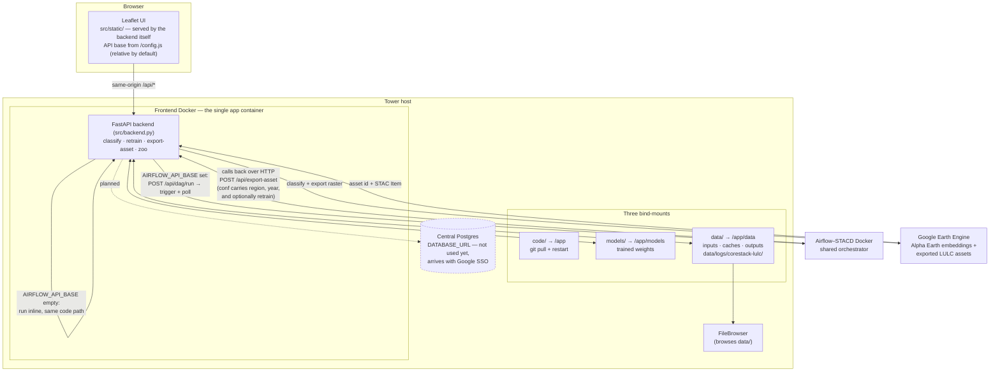

# Architecture — how compute is triggered, and from where

Cluster checklist #8. The short version: **one container serves both the UI and the API**, and a
single environment variable decides whether the long jobs run inside it or go out to Airflow.



## The switch

`AIRFLOW_API_BASE` is the only thing that decides where compute runs — there is no `COMPUTE_MODE`
flag (checklist #2 forbids one).

| `AIRFLOW_API_BASE` | What happens |
|---|---|
| **set** | The browser calls our same-origin proxy `POST /api/dag/run`; the backend triggers the DAG server-side and the page polls `GET /api/dag/status`. The DAG calls back into `POST /api/export-asset` to do the work. The browser never talks to Airflow (CORS would block it, and the creds shouldn't be in the page). |
| **empty** | The same handler runs inline in the request. No Airflow host needed — this is the laptop case. |

The same image covers both; only `.env` changes.

## Retrain rides the export path

Training is *not* a second DAG. A retrain is sent as part of the **same `op="export"` conf** the
classify/export path already uses:

```jsonc
{ "retrain": { "node": "greenery", "algo": "logreg" },
  "export": false }        // false = train and stop; omit it to train, then classify + export
```

`/api/export-asset` picks the `retrain` key out of the conf, trains first, and only then classifies
with the fresh model. So there's one DAG and one STACD algorithm registration to maintain, not two.
The training itself always runs *inside this container* — the DAG only drives us over HTTP — so the
weights, the hierarchy and the zoo cards can't drift apart.

## Where things land

- **The product of a run** is a **GEE asset** (under `EE_ASSET_ROOT`) plus a **STAC Item** describing
  it — not a file on disk. That's the deliverable the pipeline registers.
- **`data/`** holds the state that produced it: the class tree, the op-log, user example polygons,
  the model zoo, cached training tables, job bookkeeping, and logs. Retention for each path is
  declared in [`outputs.yaml`](../outputs.yaml); a host data service reads that file.
- **`models/`** holds trained weights, on their own mount so outputs can be rotated without them.
- **Logs** go to `data/logs/corestack-lulc/app.log` (rotating, 10 MB x 5) and stdout, at whatever
  `LOG_LEVEL` says.

## Not yet wired

**Google SSO (#4) and central Postgres (#9)** are parked pending further advice. Nothing in the app
authenticates today, and no database is used — checklist #9 is explicitly N/A for a service with no
database, so the two land together. The env var names are already reserved in `deploy/.env.example`.
